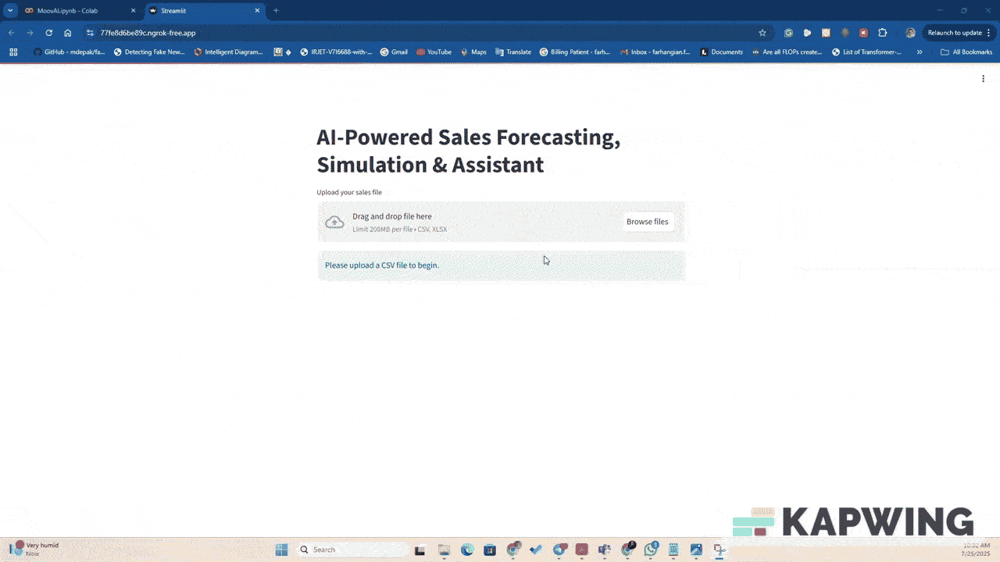

# SalesAI: Forecasting and Insights with Generative AI

This project presents a complete data science solution to forecast store-level sales using time series modeling and generate actionable business insights using Generative AI. 

---

## Project Objectives

- Predict future monthly sales using historical order data.
- Identify key drivers behind sales fluctuations.
- Extract insights at order, product, and customer levels.
- Integrate Generative AI to allow natural language interaction with the model.

## Demo Video

---

Run This Notebook
You can open and run the notebook directly in [Google Colab](https://colab.research.google.com/drive/1WQy5WMI9WAxwR1dsBw03jtKbWGX74W0F?usp=sharing)

